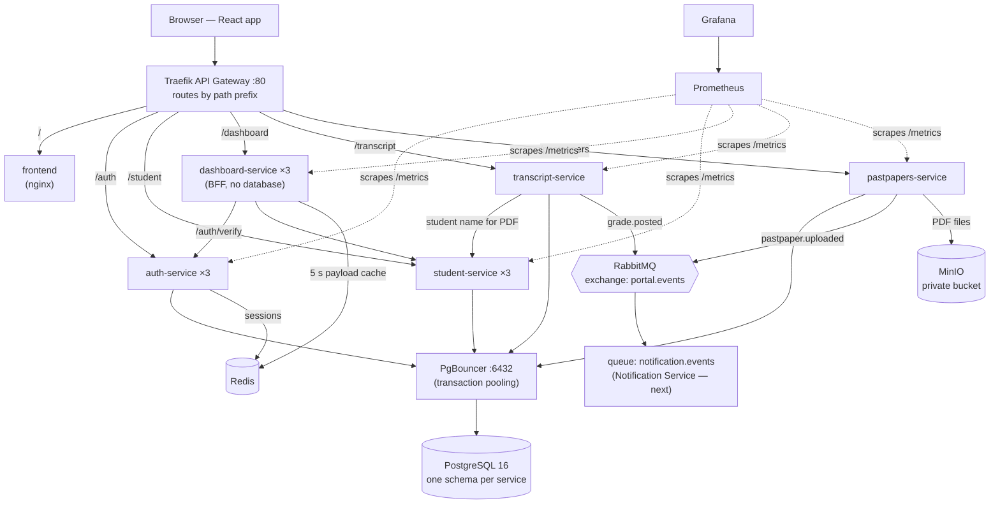

# Student Portal — Scalable Microservice Architecture

A SaaS student portal built as independently deployable microservices behind an API gateway, designed to serve **1,000 concurrent students** (3,000 registered) without falling over.

Final-year project, **Akwenwi Kenzel Che Niba**, ICT University, Yaoundé (delivery: 1 October 2026).

> **Status:** six of the seven core services are built and running (Gateway, Auth, Student, Dashboard/BFF, Transcript, Past Papers). The Notification Service is next. Monitoring (Prometheus + Grafana), Swagger docs and a React frontend are in place. See [Roadmap](#roadmap).

---

## Contents

- [Architecture](#architecture)
- [Services](#services)
- [Tech stack](#tech-stack)
- [Quick start](#quick-start)
- [First login and demo data](#first-login-and-demo-data)
- [Local URLs](#local-urls)
- [Repository layout](#repository-layout)
- [Key design decisions](#key-design-decisions)
- [Load testing](#load-testing)
- [Monitoring](#monitoring)
- [CI](#ci)
- [Configuration](#configuration)
- [Deploying to Oracle Cloud](#deploying-to-oracle-cloud)
- [Troubleshooting](#troubleshooting)
- [Security notes](#security-notes)
- [Roadmap](#roadmap)

---

## Architecture



Each service owns its data, scales independently, and is reached only through the gateway. Services talk to each other over HTTP (synchronous reads) or RabbitMQ events (asynchronous side effects), so one slow or failed service doesn't take the others down.

---

## Services

| Service | Route | Data | Responsibility |
|---|---|---|---|
| **API Gateway** (Traefik v3.6) | all | — | Single entry point; routes by path using Docker labels; load-balances across replicas automatically |
| **Auth** | `/auth` | `auth` schema + Redis | Register, login, JWT access tokens (15 min) + rotating refresh tokens (7 days), logout, password reset, roles (`student` / `lecturer` / `admin`) |
| **Student** | `/student` | `student` schema | Student profiles and enrolment records, role-based access |
| **Dashboard / BFF** | `/dashboard` | none (Redis cache) | Validates the token via Auth, gathers data from Student, returns one role-shaped payload for the home screen |
| **Transcript** | `/transcript` | `transcript` schema | Grades, credit-weighted GPA (LMD 4.0 scale), PDF transcripts via WeasyPrint; publishes `grade.posted` |
| **Past Papers** | `/pastpapers` | `pastpapers` schema + MinIO | Upload, full-text search, list and download past exam papers with download tracking; publishes `pastpaper.uploaded` |
| **Notification** | — | none | *Next:* consumes `grade.posted` / `pastpaper.uploaded` from RabbitMQ and notifies students |
| **Frontend** | `/` | — | React app: login, role-based student/staff dashboards, transcript view + PDF download, past papers search/upload/download |
| health-service | `/health` | — | Proof-of-pipeline service from Week 1 |

### API endpoints

Every service serves interactive Swagger/OpenAPI docs through the gateway: `/<service>/docs/` (e.g. http://localhost/auth/docs/).

| Service | Endpoints |
|---|---|
| Auth | `POST /auth/register` · `POST /auth/login` · `POST /auth/refresh` · `POST /auth/logout` · `POST /auth/password-reset/request` · `POST /auth/password-reset/confirm` · `GET /auth/verify` · `GET /auth/health` |
| Student | `GET /student/profile/:id` · `PUT /student/profile/:id` · `GET /student/enrolment/:id` · `POST /student/enrolment/:id` (admin) · `GET /student/health` |
| Dashboard | `GET /dashboard/home` · `GET /dashboard/health` |
| Transcript | `POST /transcript/grades` (lecturer/admin) · `GET /transcript/:studentId` · `GET /transcript/:studentId/pdf` · `GET /transcript/health` |
| Past Papers | `POST /pastpapers/upload` (lecturer/admin) · `GET /pastpapers/search` · `GET /pastpapers/list` · `GET /pastpapers/:id/download` · `GET /pastpapers/health` |

---

## Tech stack

| Concern | Choice |
|---|---|
| Services | Node.js 20 + Express |
| Frontend | React 19 + Vite, served by nginx |
| API gateway | Traefik v3.6 |
| Database | PostgreSQL 16, one schema per service |
| Connection pooling | PgBouncer (transaction mode) |
| Cache / sessions | Redis 7 |
| Event bus | RabbitMQ 3 (topic exchange) |
| Object storage | MinIO (Chainguard image) |
| PDF generation | WeasyPrint |
| Monitoring | Prometheus + Grafana (provisioned as code) |
| Load testing | k6 |
| Containers / CI | Docker Compose, GitHub Actions |
| Target hosting | Oracle Cloud Always Free |

---

## Quick start

**Prerequisites:** Docker Desktop (or Docker Engine + Compose plugin) with ~8 GB RAM available. Nothing else needs to be installed locally.

```bash
git clone https://github.com/Kenzel57/Student-portal.git
cd Student-portal
git checkout docker

cp .env.example .env          # dev defaults; change them before deploying anywhere public
docker compose up -d --build  # first build takes a few minutes
```

Check that everything is up:

```bash
docker compose ps
curl http://localhost/auth/health        # {"status":"ok",...,"checks":{"database":"ok","redis":"ok"}}
curl http://localhost/pastpapers/health  # database, minio and rabbitmq all "ok"
```

Then open **http://localhost**.

Tear down (add `-v` to also delete all data):

```bash
docker compose down
```

---

## First login and demo data

A fresh install has **one account**: the bootstrap admin, created on startup from `.env`.

| Email | Password |
|---|---|
| `admin@portal.local` | `admin_dev_pw` |

Only students can self-register; creating lecturer or admin accounts requires an admin's token. The quickest way to set up demo accounts is Swagger at http://localhost/auth/docs/:

1. **POST /auth/login** as the admin and copy the `accessToken`.
2. Click **Authorize** and paste the token.
3. **POST /auth/register** with `{"email": "lecturer@portal.local", "password": "lecturerpw1", "role": "lecturer"}`.
4. **POST /auth/register** (no token needed) with `{"email": "student@portal.local", "password": "studentpw1"}` for a student.
5. As the admin, create the student's profile at http://localhost/student/docs/ (`PUT /student/profile/{id}`, using the `user.id` from registration) and add an enrolment (`POST /student/enrolment/{id}`).
6. As the lecturer, post grades at http://localhost/transcript/docs/ and upload past papers from the **Past Papers** tab in the app.

Log in at http://localhost as the student to see the populated dashboard, transcript and past papers.

---

## Local URLs

| What | URL | Login (dev defaults) |
|---|---|---|
| **Web app** | http://localhost | see above |
| Swagger docs | http://localhost/auth/docs/ (also `/student`, `/dashboard`, `/transcript`, `/pastpapers`) | — |
| Traefik dashboard | http://localhost:8080/dashboard/ | — |
| Grafana | http://localhost:3001/d/student-portal-live | `admin` / `admin` |
| Prometheus | http://localhost:9090 | — |
| RabbitMQ management | http://localhost:15672 | `portal` / `changeme` |
| MinIO console | http://localhost:9001 | `portal_admin` / `changeme123` |
| pgAdmin | http://localhost:5050 | `admin@example.com` / `changeme` — then add a server with host **`postgres`**, port `5432`, user `portal_admin`, password `changeme` |

PgBouncer has no UI; inspect it with its admin console:

```bash
docker exec -e PGPASSWORD=changeme portal-postgres \
  psql -h pgbouncer -p 6432 -U portal_admin -d pgbouncer -c "SHOW POOLS;"
```

---

## Repository layout

```
.
├── docker-compose.yml          # the whole system
├── .env.example                # all configuration, with dev defaults
├── init-db/01-schemas.sql      # creates one schema + one role per service
├── services/
│   ├── auth-service/           # each service: package.json, Dockerfile, index.js,
│   ├── student-service/        #   db.js (pool + migrations), metrics.js (Prometheus),
│   ├── dashboard-service/      #   plus events.js / storage.js where needed
│   ├── transcript-service/
│   ├── pastpapers-service/
│   ├── frontend/               # React + Vite app, built into nginx
│   └── health-service/
├── monitoring/
│   ├── prometheus.yml          # scrape config (Docker DNS discovery per replica)
│   └── grafana/                # provisioned data source + "Student Portal — Live" dashboard
├── loadtests/
│   ├── auth-login.js           # k6: login throughput
│   ├── portal-flow.js          # k6: realistic sessions across Auth + Student + Dashboard
│   └── results/                # saved k6 summaries (JSON)
├── .github/workflows/ci.yml    # per-service build + test, then full compose smoke test
├── setup-oracle-cloud.sh       # one-shot provisioning for Oracle Cloud
├── diagnose-socket.ps1         # Windows Docker socket diagnostics
└── Action.md                   # dated log of every change, test and finding
```

---

## Key design decisions

**Schema-per-service, one Postgres instance.** Each service connects with its own role (`auth_svc`, `student_svc`, …) that can only reach its own schema, so the database enforces service boundaries. There are no cross-schema foreign keys. This gives the same isolation in code as database-per-service with far less connection-pooling and operations overhead.

**PgBouncer in front of Postgres.** Every service connects to `pgbouncer:6432`, never `postgres:5432`. Each replica holds at most 10 client connections; PgBouncer multiplexes all of them onto a small pool of real Postgres connections. This is the main defence against connection exhaustion at 1,000 users.

**Stateless JWTs, rotating refresh tokens.** Access tokens carry `sub`, `role` and `institution_id`, so services authorise requests by verifying a signature, with no database hit. Refresh tokens are random, single-use and rotated on every refresh. Active sessions live in Redis (claimed atomically with `GETDEL`), and a durable record is kept in Postgres. Only hashes are stored. Passwords use bcrypt (cost 10).

**Role-based access, enforced in the backend.** The frontend picks a student or staff dashboard from the role in the login response, but every API re-checks the signed JWT: students see only their own records, only staff post grades or upload papers, only admins create staff accounts.

**Multi-tenant from day one.** Every table has `institution_id`, and every query is scoped by the token's institution.

**Backend-for-Frontend with graceful degradation.** `/dashboard/home` combines Auth and Student into one response and caches it in Redis for 5 seconds. If the Student Service is down, the dashboard still answers, marks the payload `degraded`, and doesn't cache it.

**Event-driven side effects.** Transcript and Past Papers publish persistent events to the `portal.events` topic exchange with publisher confirms, only after the database commit. A durable `notification.events` queue holds them until the Notification Service consumes them, so notifications never block grading or uploads.

**Storage split.** PDFs go to MinIO (a private bucket, server-generated object keys, uploads verified by file content). Metadata and a generated `tsvector` column with a GIN index live in Postgres, so search is plain Postgres full-text search, with no separate search engine.

**Safe PDF rendering.** Transcript data is HTML-escaped before it reaches WeasyPrint, which prevents markup injection and server-side request forgery. Concurrent renders are capped per replica.

**Horizontal scaling.** Stateless services have no `container_name` and set their replica count in Compose. Traefik and Prometheus discover new replicas automatically.

---

## Load testing

k6 runs in Docker, so nothing needs installing. From the project root:

```bash
# Login throughput (VUS = number of virtual users)
docker run --rm -e VUS=100 -e BASE_URL=http://host.docker.internal \
  -v "$PWD/loadtests:/scripts" grafana/k6 run /scripts/auth-login.js

# Realistic sessions: 750 students, each logs in once, then loads the
# dashboard and enrolment every ~1 s; ramps 100 -> 500 -> 750 users
docker run --rm -e BASE_URL=http://host.docker.internal \
  -v "$PWD/loadtests:/scripts" grafana/k6 run /scripts/portal-flow.js
```

(On Windows PowerShell use `-v "${PWD}\loadtests:/scripts"`.) Each run prints p50/p95/p99 latency with PASS/FAIL against its thresholds, and saves a JSON summary to `loadtests/results/`.

**Results so far** (local laptop, 12 CPUs, with k6 running on the same machine):

| Test | Result |
|---|---|
| Login, 100 users, 3 Auth replicas | p95 **301 ms**, 0 errors: **pass** (was 1,163 ms with 1 replica) |
| Login, 500 users | p95 4.8 s: fail. Bcrypt is CPU-bound by design; ~87 logins/s ≈ 313,000 logins/hour |
| Portal sessions, 100 users | all p95 < 45 ms |
| Portal sessions, 750 users, 3 replicas each | 0% errors, 99.9% checks, ~1,150 req/s peak; p95 1.2–1.6 s: fails the < 500 ms target |

Scaling Student and Dashboard from 1 to 3 replicas cut degraded dashboards from 28% to ~0.1% and raised throughput ~70%. At 750 users the laptop itself is CPU-saturated (~10 of 12 cores), so more replicas can't help there. The defensible 1,000-user numbers must come from the deployed system with k6 on a **separate machine**. Every run, bottleneck and fix is written up in [Action.md](Action.md).

---

## Monitoring

Every service exposes `/metrics` (request-latency histograms per route, plus Node CPU, memory and event-loop lag) on the internal network only. Prometheus scrapes each replica every 5 seconds. Grafana starts with the data source and the **Student Portal — Live** dashboard already provisioned: requests per second, p95 latency, 5xx error rate, CPU per replica, latency per route, and event-loop lag.

Open http://localhost:3001/d/student-portal-live while a load test runs to see where the system saturates.

---

## CI

`.github/workflows/ci.yml` runs on every push:

1. **Per service** (matrix): `npm install`, `npm test` (a smoke test; for the frontend, a production build) and `docker build`.
2. **Compose smoke test:** brings up the full stack from `.env.example` and waits for the gateway to route `/health`.

---

## Configuration

All settings live in `.env` (copy from `.env.example`). Main variables:

| Variable | Purpose | Dev default |
|---|---|---|
| `POSTGRES_USER` / `POSTGRES_PASSWORD` / `POSTGRES_DB` | Database superuser and name | `portal_admin` / `changeme` / `student_portal` |
| `RABBITMQ_USER` / `RABBITMQ_PASSWORD` | RabbitMQ login (also used by the services) | `portal` / `changeme` |
| `JWT_SECRET` | Signs every access token; shared by all services | `dev_secret_change_me` |
| `BOOTSTRAP_ADMIN_EMAIL` / `BOOTSTRAP_ADMIN_PASSWORD` | First admin, created on startup | `admin@portal.local` / `admin_dev_pw` |
| `MINIO_USER` / `MINIO_PASSWORD` | MinIO root login (password ≥ 8 chars) | `portal_admin` / `changeme123` |
| `GRAFANA_ADMIN_USER` / `GRAFANA_ADMIN_PASSWORD` | Grafana login | `admin` / `admin` |
| `PGADMIN_DEFAULT_EMAIL` / `PGADMIN_DEFAULT_PASSWORD` | pgAdmin login | `admin@example.com` / `changeme` |
| `AUTH_REPLICAS`, `STUDENT_REPLICAS`, `DASHBOARD_REPLICAS`, `TRANSCRIPT_REPLICAS`, `PASTPAPERS_REPLICAS` | Replica counts | 3, 3, 3, 1, 1 |
| `AUTH_THREADPOOL_SIZE` | libuv threads per Auth replica (bcrypt) | 4 |
| `DOCKER_ENDPOINT` | Optional: point Traefik at the Docker daemon over TCP instead of the socket | unset (socket) |

The per-service database passwords (`auth_dev_pw`, …) are set in `init-db/01-schemas.sql` and `docker-compose.yml`.

---

## Deploying to Oracle Cloud

On a fresh Oracle Cloud Always Free Ubuntu instance:

```bash
chmod +x setup-oracle-cloud.sh
./setup-oracle-cloud.sh https://github.com/Kenzel57/Student-portal.git
```

The script installs Docker and the Compose plugin, opens ports 80 and 8080, clones the repo, creates `.env` from the example, and starts the stack. **Replace every default secret in `.env` first** (see [Security notes](#security-notes)).

---

## Troubleshooting

**Gateway logs show `Error response from daemon` and every route returns 404.** Traefik can't read container labels from Docker. With Docker Engine 29+, Traefik versions older than v3.6 are rejected by the Docker API (this project pins v3.6). On Docker Desktop for Windows you can also route Traefik over TCP: enable *Settings → General → Expose daemon on tcp://localhost:2375 without TLS* and set `DOCKER_ENDPOINT=tcp://host.docker.internal:2375` in `.env`. `diagnose-socket.ps1` helps narrow down socket problems.

**A service keeps restarting.** Run `docker compose logs <service>`. Services retry their database, MinIO and RabbitMQ connections on startup, so the usual cause is a wrong password in `.env` after the volumes were first created. Postgres only applies `init-db/` and its credentials when its volume is new.

**`/pastpapers/...` returns the web app's HTML.** The Past Papers Service isn't running, so the request fell through to the frontend's catch-all route. Check `docker compose ps pastpapers-service`.

---

## Security notes

This configuration is for local development. Before exposing it anywhere:

- Replace **every** default in `.env`: `JWT_SECRET` (use a long random value), all passwords, and the per-service DB passwords in `init-db/01-schemas.sql`.
- Disable the Traefik dashboard (`--api.insecure=true`) or put it behind authentication.
- Don't expose pgAdmin, Prometheus, Grafana, the RabbitMQ UI or the MinIO console publicly.
- Give the Past Papers Service its own MinIO user limited to its bucket, instead of the root account.
- `.env` is currently tracked in git (dev defaults only). It should be removed from version control and listed in `.gitignore`.

Known hardening items for after the deadline: refresh tokens in httpOnly cookies instead of `sessionStorage`, a transactional outbox for guaranteed event delivery, and signed short-lived download URLs.

---

## Roadmap

Scope follows the project plan's tiers.

**Core (in progress)**

- [x] API Gateway, Auth, Student, Dashboard/BFF, Transcript, Past Papers
- [x] Prometheus + Grafana, Swagger docs, React frontend
- [ ] Notification Service (minimal: consume both events, one template each)
- [ ] Full-system load test at 250 / 500 / 750 / 1,000 users from a separate machine against the Oracle Cloud deployment
- [ ] Report, final architecture diagram, backup demo video

**Stretch** (only once the 1,000-user test passes): Timetable, Course & Enrolment, Announcements, Audit Service, centralised logging (Loki).

**Post-deadline:** Fees & Payments (MTN MoMo / Orange Money sandbox), Admin/Institution multi-tenant management, Meilisearch, Reporting/Analytics.

---

## Author

**Akwenwi Kenzel Che Niba**, ICT University, Yaoundé. Final-year project, 2026.

The full development history, with every change, test result, bottleneck found and design rationale, is in [Action.md](Action.md).
